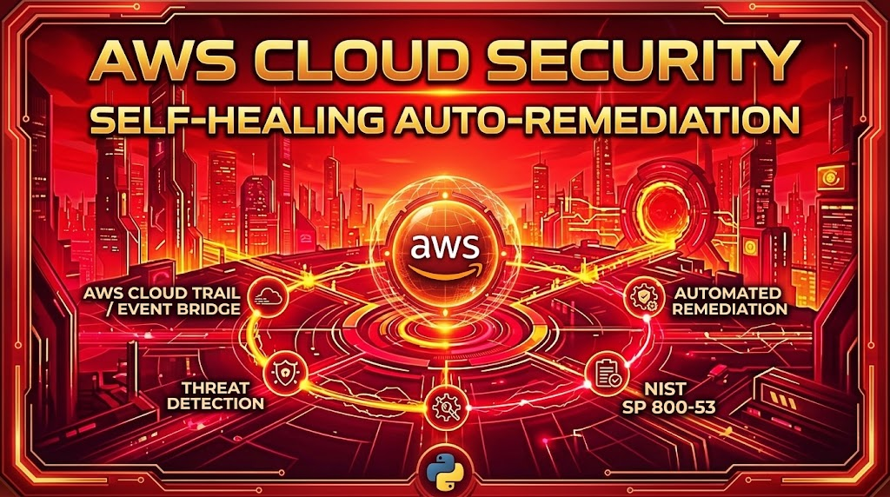
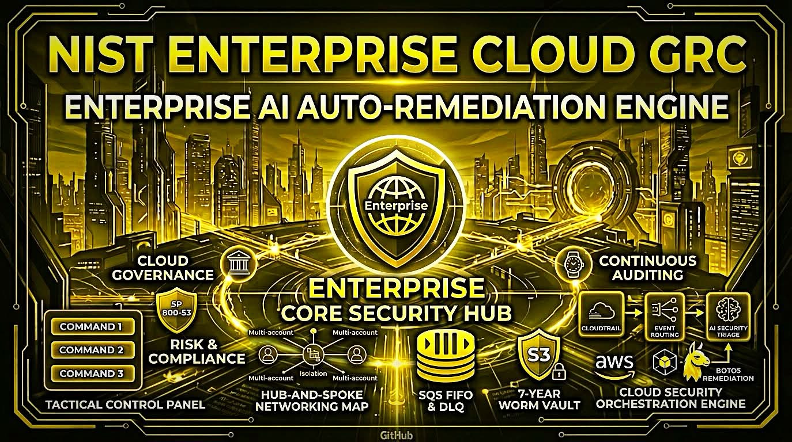
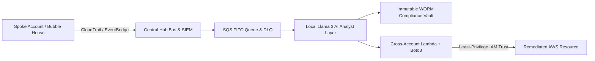

# 🪐 NIST Cloud Sentinel: Enterprise GRC & Auto-Remediation Engine
[](https://youtu.be/9zMSsTNIVo4)

[](https://youtu.be/eJ5s4WVHV4k)


An enterprise-grade, multi-account, self-healing cloud compliance orchestrator and DevSecOps platform enforcing **NIST SP 800-53 High-Impact Guardrails** across global AWS environments. Designed to eliminate configuration drift, halt non-compliant CI/CD builds via POSIX circuit breakers, and execute automated Boto3 closed-loop auto-remediation in real time.

---

## 🏗️ Architectural Overview & Data Flow



---

### 📋 Complete Enterprise Architecture Briefing *(✨ Newly Added)*

### 1. Core Architecture & Multi-Account Hub-and-Spoke Model
* **Enterprise Governance Framework:** Designed an enterprise multi-account security governance framework using a Hub-and-Spoke topology.
* **Edge Spoke Ingestion:** Edge Spoke accounts capture raw AWS CloudTrail API events and route drift events securely across accounts into the Central Hub bus, where local logs are aggregated and superseded by a centralized enterprise **SIEM command center (CloudTrail 2.0)**.
* **Blast Radius Containment:** Enforced strict IAM least-privilege trust policies and boundary guardrails to isolate spoke accounts into secure "bubble houses," containing blast radiuses locally and completely blocking lateral movement back to the central control plane.

### 2. High-Volume SQS Buffer & Pre-Check Guardrails
* **Asynchronous Processing Pipeline:** Built a dual-layer asynchronous processing pipeline utilizing AWS SQS FIFO queues and a Dead Letter Queue (DLQ).
* **Fault-Tolerant Error Handling:** Configured queue error handling with custom redrive policies (routing to DLQ after 3 failed attempts) and 14-day message retention for forensic inspection, preventing infinite execution loops and API throttling.
* **Intelligent Pre-Checks:** Implemented fast programmatic SQS pre-guardrails to filter major risks before passing structured payloads to the deep-context AI analysis layer.

### 3. AI-Driven Analysis & Automated Remediation
* **Local LLM Intelligence:** Integrated local Llama 3 AI analysis (via Ollama) to evaluate drift telemetry, calculate contextual risk scores, and orchestrate automated tier-1 responses with zero data leakage outside the secure VPC perimeter.
* **Closed-Loop Boto3 Automation:** Developed closed-loop Python / Boto3 automation scripts that execute immediate remediation (e.g., enforcing S3 Public Access Block settings and closing exposed security group ports) via secure cross-account IAM trust relationships.
* **CI/CD Circuit Breaker:** Wired a strict POSIX circuit breaker policy that halts non-compliant CI/CD builds via exit code `1` unless auto-remediation is engaged, blocking unencrypted storage or exposed management ports.

### 4. Immutable WORM Compliance Vault (7-Year Lock)
* **Dedicated Audit Storage:** Deployed a dedicated Amazon S3 audit storage vault equipped with Compliance Mode Object Lock.
* **Cryptographic Sealing:** Cryptographically sealed pre-remediation forensic snapshots to ensure unalterable, tamper-proof logs meeting strict regulatory standards (SOC 2, PCI-DSS, HIPAA).
* **Full Framework Alignment:** Aligned controls directly to NIST SP 800-53 High-Impact Families (AC, AU, SC, CM, IA, IR, RA).

### 5. Infrastructure as Code (IaC) & Streamlit Command Center
* **Terraform Provisioning:** Fully provisioned the entire cloud architecture via production-grade Terraform (validated clean via `terraform validate` and `terraform plan`).
* **Tactical Command Center (`dashboard_app.py`):** Built an interactive, high-performance Streamlit frontend dashboard featuring custom tactical UI themes, live control family telemetry grids, drift simulators, multi-account scope toggling, and JavaScript-driven smooth-fading architecture briefing components.

---

## 🛡️ Full-Spectrum NIST SP 800-53 Mapping
* **AC (Access Control):** Enforces S3 Public Access Block policies, least privilege IAM policies, and closed SSH/RDP ingress ports.
* **AU (Audit & Accountability):** Captures structured UTC logs, CloudTrail event trails, and immutable audit metadata for auditor verification.
* **SC (System & Comms Protection):** Mandates AES-256/KMS encryption at rest and active KMS key rotation.
* **CM (Configuration Management):** Restricts baseline parameters and prevents unauthorized baseline alterations across staging and production.
* **IA (Identification & Authentication):** Enforces multi-factor authentication (MFA) policies for high-privilege operations.
* **IR (Incident Response):** Triggers immediate event-driven remediation upon policy drift detection.
* **RA (Risk Assessment):** Integrates continuous security posture scanning across multi-region cloud assets.

---

## 📂 Repository Structure

```text
grc-automation-engine/
├── dashboard_app.py           # Streamlit SOC Telemetry Dashboard & Interactive Controls
├── remediation_engine.py      # Boto3 Closed-Loop Auto-Remediation Engine
├── test_payload_devsec104.json # Target S3 Audit Log & Compliance Telemetry Payload
├── tests/                     # Pytest Security Guardrail Assertions & CI/CD Circuit Breakers
├── requirements.txt           # Python Dependencies (Streamlit, Boto3, Pytest, Pandas, Plotly)
└── README.md                  # System Documentation
```

---

## 🚀 Quickstart & Local Setup

### **1. Clone Repository & Initialize Environment**
```bash
git clone [https://github.com/YOUR_GITHUB_USERNAME/grc-automation-engine.git](https://github.com/YOUR_GITHUB_USERNAME/grc-automation-engine.git)
cd grc-automation-engine
python3 -m venv venv
source venv/bin/activate
pip install -r requirements.txt
```

### **2. Execute CI/CD Security Circuit Breaker Tests**
```bash
pytest -v
```

### **3. Launch the SOC Telemetry Portal**
```bash
streamlit run dashboard_app.py
```
*Access the live dashboard at `http://localhost:8501`.*

---

## 📊 Live Operations & Demonstration Workflow

1. **Active Fleet Telemetry:** View 100% compliance health, control family distribution charts, and active AWS CloudTrail event streams.
2. **Simulate Configuration Drift:** Click **🚨 Simulate Configuration Drift** to disable S3 Public Access Block policies and observe real-time score drops.
3. **Trigger Auto-Remediation:** Click **⚡ Execute Boto3 Auto-Remediation** to execute the closed-loop Python engine, capture an immutable WORM forensic snapshot, and restore fleet compliance back to `100%`.
4. **Export Compliance Audit:** Click **📥 Export Compliance Audit Report (CSV)** to generate timestamped, auditor-ready evidence.